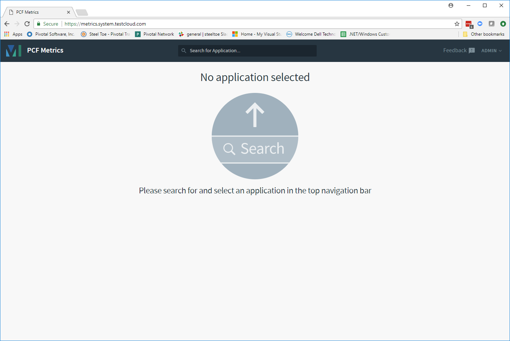
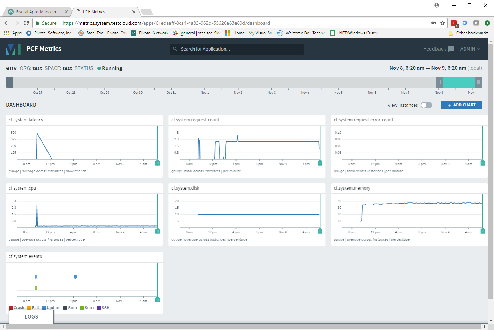

# Lab 4 - Monitoring Applications

>Pivotal Cloud Foundry makes the work of performing actions such as managing logs or monitoring the performance of an application very easy. In this lab we'll explore some of these capabilities.

## Preparation

If your instance of the sample app `env` is not running after the steps completed in Lab 1, make sure to follow the [instructions](../Lab01/README.md) again to deploy the application.

## Cloud Foundry Application Logs

One of the most important enablers of visibility into application behavior is logging. Effective management of logs has historically been difficult or required wiring into third party tools. Cloud Foundry's [log aggregation](https://docs.pivotal.io/pivotalcf/1-7/loggregator/architecture.html) components simplify log management by assuming complete responsibility for it. Application developers need only log all messages to `STDOUT` or `STDERR`, and the platform will capture these messages.

## Dumping Logs

Application developers can dump recent application logs using the CF CLI.

1. To view recent log messages for the `env` application, simply enter:

   ```bash
    > cf logs env --recent
   ```

1. Below is the kind of output you would expect to see after entering the above command.

   ```bash
   > cf logs env --recent
   Retrieving logs for app env in org instructor / space development as admin...
   2016-10-16T20:51:06.59-0400 [CELL/1]     OUT Creating container
   2016-10-16T20:51:07.18-0400 [CELL/1]     OUT Successfully created container
   2016-10-16T20:51:07.59-0400 [CELL/1]     OUT Starting health monitoring of container
   2016-10-16T20:51:11.11-0400 [APP/1]      OUT PORT == 51721
   2016-10-16T20:51:11.11-0400 [APP/1]      OUT Running ..\tmp\lifecycle\WebAppServer.exe
   2016-10-16T20:51:11.11-0400 [APP/1]      OUT 2016-10-17 00:51:08Z|INFO|Port:51721
   2016-10-16T20:51:11.11-0400 [APP/1]      OUT 2016-10-17 00:51:08Z|INFO|Webroot:c:\containerizer\034C916AB3FD51DA35\user\app
   2016-10-16T20:51:11.11-0400 [APP/1]      OUT 2016-10-17 00:51:08Z|INFO|Starting web server instance...
   2016-10-16T20:51:11.11-0400 [APP/1]      OUT Checking DB structure.
   2016-10-16T20:51:11.11-0400 [APP/1]      OUT Server Started.... press CTRL + C to stop
   2016-10-16T20:51:11.62-0400 [CELL/1]     OUT Container became healthy
   2016-10-16T20:52:11.63-0400 [API/0]      OUT Updated app with guid e59bfcea-1a35-4b5f-ae84-2d7c78e13976 ({"instances"=>3})
   2016-10-16T20:54:11.63-0400 [RTR/0]      OUT env-grumous-imperativeness.cfapps.haas-76.pez.pivotal.io - [17/10/2016:00:54:11.128 +0000] "GET / HTTP/1.1" 200 0 8376 "http://env-grumous-imperativeness.cfapps.haas-76.pez.pivotal.io/" "Mozilla/5.0 (Macintosh; Intel Mac OS X 10_11_1) AppleWebKit/537.36 (KHTML, like Gecko) Chrome/53.0.2785.116 Safari/537.36" 10.193.145.250:44800 x_forwarded_for:"10.193.145.1" x_forwarded_proto:"http" vcap_request_id:60153894-cfdc-444d-7e0f-77faa17d01fb response_time:0.006277964 app_id:e59bfcea-1a35-4b5f-ae84-2d7c78e13976

   2016-10-16T22:58:29.70-0400 [APP/0]      OUT Kaboom.
   2016-10-16T22:58:29.72-0400 [APP/0]      OUT Exit status -1
   ```

As you can see, Cloud Foundry's log aggregation components capture both application logs and CF component logs relevant to your application. These log events are properly interleaved based on time, giving you an accurate picture of events as they transpired across the system.

* An `Apache-style` access log event from the (Go)Router `RTR`
* An `API` log event that corresponds to an event as shown in `cf events`
* A `CELL` log event indicating the start of an application instance on that `CELL`
* A `APP` log output showing `Kaboom` when the `Kill App` menu item is pressed in the .NET `env` app

## Tailing Logs

1. To get a running ``tail`` of the application logs rather than a dump, simply enter:

   ```bash
   > cf logs env
   ```

   You can try various things like refreshing the browser and triggering stop/start events to see the logs being generated.

## Health Management

Various Cloud Foundry components actively monitor the health of the application processes running on the platform and will attempt to restart them should they crash.

1. To see how this works, start a log tail for `env` if you don't have one already running.

   ```bash
   > cf logs env
   ```

1. If you do not have more than one application instance running, execute the scale command to scale `env` to 2 or more instances.  Visit the application in the browser, and click on the ``Kill App`` menu item. This menu item triggers an `Environment.Exit(-1)` causing the instance to crash and the Cloud Foundry Health Manager to observe an application instance crash.

   ---

    

   ---

1. After clicking the ``Kill App`` menu item a couple of interesting things should happen. First, you'll see an error code returned in the browser as the request you submitted never returns a response.

   ---

    

   ---

   Also, if you're paying attention to the log tail, you'll see some interesting log messages fly by:

    ```bash
    2016-10-16T22:56:22.22-0400 [API/0]      OUT App instance exited with guid e59bfcea-1a35-4b5f-ae84-2d7c78e13976 payload: {"instance"=>"8fb02068-684d-48c5-42b1-c0b800c57b4d", "index"=>0, "reason"=>"CRASHED", "exit_description"=>"2 error(s) occurred:\n\n* 2 error(s) occurred:\n\n* Exited with status -1\n* cancelled\n* 1 error(s) occurred:\n\n* cancelled", "crash_count"=>1, "crash_timestamp"=>1476672982202265440, "version"=>"796dc91d-af0a-4784-8fb4-2c88448c4ad3"}
    2016-10-16T22:56:22.75-0400 [API/0]      OUT Updated app with guid e59bfcea-1a35-4b5f-ae84-2d7c78e13976
    2016-10-16T22:58:29.70-0400 [APP/0]      OUT Kaboom.
    2016-10-16T22:58:29.72-0400 [APP/0]      OUT Exit status -1
    2016-10-16T22:58:29.84-0400 [CELL/0]     OUT Exit status -26
    ```

    * Just before issuing the `Environment.Exit(-1)` call, the application logs that the kill switch was clicked (i.e `Kaboom.`).
    * The `API` logs that an application instance exited due to a crash.

1. Wait a few seconds, and then after a bit you should have noticed some additional interesting events in the logs:

    ```bash
    2016-10-16T22:58:29.87-0400 [CELL/0]     OUT Creating container
    2016-10-16T22:58:30.37-0400 [CELL/0]     OUT Successfully created container
    2016-10-16T22:58:30.78-0400 [CELL/0]     OUT Starting health monitoring of container
    2016-10-16T22:58:30.91-0400 [APP/0]      OUT Running ..\tmp\lifecycle\WebAppServer.exe
    2016-10-16T22:58:30.92-0400 [APP/0]      OUT PORT == 58849
    2016-10-16T22:58:30.93-0400 [APP/0]      OUT 2016-10-17 02:58:30Z|INFO|Port:58849
    2016-10-16T22:58:30.93-0400 [APP/0]      OUT 2016-10-17 02:58:30Z|INFO|Webroot:c:\containerizer\C2AB9FCE9A99DA8757\user\app
    2016-10-16T22:58:30.94-0400 [APP/0]      OUT 2016-10-17 02:58:30Z|INFO|Starting web server instance...
    2016-10-16T22:58:30.98-0400 [APP/0]      OUT Server Started.... press CTRL + C to stop
    2016-10-16T22:58:33.95-0400 [CELL/0]     OUT Container became healthy
    ```
   * The `CELL` indicates that it is starting another instance of the application as a result of the Health Manager observing a difference between the desired and actual state (i.e. running instances = 1 vs. running instances = 0).
   * The new application instance starts logging events as it starts up.

## Viewing Application Events

Cloud Foundry only allows application configuration to be modified via its API. This gives application operators confidence that all changes to application configuration are known and audited. It also reduces the number of causes that must be considered when problems arise.

All application configuration changes are recorded as _events_. These events can be viewed via the Cloud Foundry API, and viewing is facilitated via the CLI.

1. Take a look at the events that have transpired so far for our deployment of `env`. You should see something like below:

   ```bash
   > cf events env
   Getting events for app env in org instructor / space development as admin...

   time                          event                   actor   description
   2016-10-16T22:59:33.00-0400   app.crash               env     index: 0, reason: CRASHED, exit_description: 2 error(s) occurred:

                                                                 * 2 error(s) occurred:

                                                                 * Exited with status -1
                                                                 * cancelled
                                                                 * cancelled
   2016-10-16T22:56:23.00-0400   audit.app.update        admin   state: STARTED
   2016-10-16T22:56:22.00-0400   audit.app.update        admin   state: STOPPED
   2016-10-16T22:54:27.00-0400   audit.app.update        admin   instances: 2
   2016-10-16T21:56:13.00-0400   audit.app.update        admin
   2016-10-16T21:56:13.00-0400   audit.app.unmap-route   admin
   2016-10-16T21:51:52.00-0400   audit.app.update        admin
   2016-10-16T21:51:52.00-0400   audit.app.map-route     admin
   2016-10-16T21:03:22.00-0400   audit.app.update        admin   instances: 1
   2016-10-16T20:53:26.00-0400   audit.app.update        admin   instances: 3
   2016-10-16T20:53:18.00-0400   audit.app.update        admin   instances: 1
   2016-10-16T20:52:10.00-0400   audit.app.update        admin   instances: 3
   2016-10-16T20:37:46.00-0400   audit.app.update        admin   state: STARTED
   2016-10-16T20:37:46.00-0400   audit.app.update        admin   state: STOPPED
   2016-10-16T20:13:09.00-0400   audit.app.update        admin   state: STARTED
   2016-10-16T20:13:06.00-0400   audit.app.update        admin
   2016-10-16T20:13:06.00-0400   audit.app.map-route     admin
   2016-10-16T20:13:04.00-0400   audit.app.create        admin   instances: 1, memory: 512, state: STOPPED, environment_json: PRIVATE DATA HIDDEN
   ```

   * Events are sorted newest to oldest, so we'll start from the bottom. Here we see the `app.create` event, which created our application's record and stored all of its metadata (e.g. `memory: 512`).
   * The `app.map-route` event records the incoming request to assign a route to our application.
   * An `app.update` event records the resulting change to our applications metadata.
   * An `app.update` event records the change of our application's state to `STARTED`.
   * Remember scaling the application up? An `app.update` event records the metadata change `instances: 2`.
   * Also there's the `app.crash` event recording that we encountered a crash of an application instance.

1. Explicitly ask for the application to be stopped:

   ```bash
   > cf stop env
   Stopping app env in org instructor / space development as admin...
   OK
   ```

1. Examine the additional `app.update` event.  You should see something like below contained within the listed events.

   ```bash
   > cf events env
   Getting events for app env in org instructor / space development as admin...

   time                          event                   actor   description
   2016-10-16T23:11:21.00-0400   audit.app.update        admin   state: STOPPED
   2016-10-16T22:59:33.00-0400   app.crash               env     index: 0, reason: CRASHED, exit_description: 2 error(s) occurred:

                                                                 * 2 error(s) occurred:

                                                                 * Exited with status -1
                                                                 * cancelled
                                                                 * cancelled

   ```

1. Start the application again.

   ```bash
   > cf start env
   Starting app env in org instructor / space development as admin...

   0 of 2 instances running, 2 starting
   2 of 2 instances running

   App started

   Showing health and status for app env in org instructor / space development as admin...


   name:              env
   requested state:   started
   instances:         1/1
   usage:             512M x 1 instances
   routes:            env-undarned-tack.apps.testcloud.com
   last uploaded:     Wed 08 Nov 09:33:28 MST 2017
   stack:             cflinuxfs2
   buildpack:         ASP.NET Core (buildpack-1.0.22)

        state     since                    cpu    memory           disk         details
   #0   running   2016-10-16 11:14:20 PM   0.0%   105.2M of 512M   3.8M of 1G
   #1   running   2016-10-16 11:14:21 PM   0.0%   105.1M of 512M   3.8M of 1G

   ```

1. And again, view the additional `app.update` event:

   ```bash
   > cf events env
   Getting events for app env in org instructor / space development as admin...

   time                          event                   actor   description
   2016-10-16T23:14:15.00-0400   audit.app.update        admin   state: STARTED
   2016-10-16T23:11:21.00-0400   audit.app.update        admin   state: STOPPED
   ```

## Viewing Application Metrics with PCF Metrics

1. To access PCF Metrics go to this URL in your browser (e.g. <https://metrics.run.haas-76.pez.pivotal.io>). Select the application you want to see metrics from in the selection box

    ---

    

   ---

1. Explore the container and network metrics and correlate them with your logs!

    ---

    

   ---

1. For more information about PCF Metrics checkout the [documentation](https://docs.pivotal.io/pcf-metrics/1-4/index.html).
